# WorthyBound Architecture and Function Flows

Updated 7 October 2026. Live on Solana devnet at https://worthybound.com. Source code: https://github.com/BBoy416/WORTHYBOUND. Sections mark what is built and what is planned.

## Product positioning

Headline: "Real assets. Proven identity."

"Every valuable item has a story. WorthyBound gives yours a digital passport—with a sealed evidence vault, a Trust Score supported by evidence and verification, and an ownership token on Solana."

Landing page authenticity line: "A token alone does not prove authenticity. The evidence behind it—and the people who verify it—build trust."

Tagline: "Tokenize the item. Unlock its story. Earn the trust."

The verification-route ceilings are those listed under 7a Trust Score and passport: owner evidence that passed automatic checks 65; one online review 75; two online reviews 80; one in-person inspection 85; online review plus an independent in-person inspection 90; two independent in-person inspections 100. These are ceilings, not guaranteed scores.

## Overall architecture

The web app uses the API for decisions and presigned URLs for file uploads. Both background workers run inside the API process.

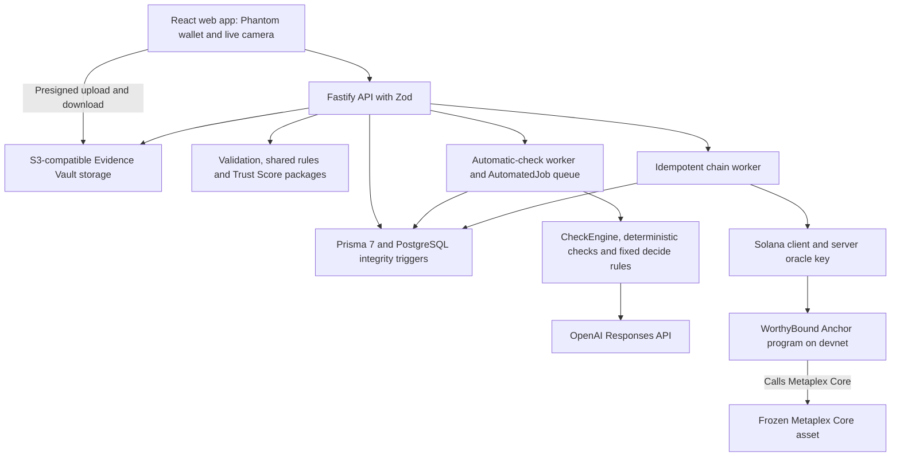
```mermaid
flowchart TD
Web["React web app: Phantom wallet and live camera"] --> API["Fastify API with Zod"]
Web -->|"Presigned upload and download"| S3["S3-compatible Evidence Vault storage"]
API --> Packages["Validation, shared rules and Trust Score packages"]
API --> DB["Prisma 7 and PostgreSQL integrity triggers"]
API --> S3
API --> Checks["Automatic-check worker and AutomatedJob queue"]
Checks --> Engine["CheckEngine, deterministic checks and fixed decide rules"]
Engine --> OpenAI["OpenAI Responses API"]
Checks --> DB
API --> Chain["Idempotent chain worker"]
Chain --> Client["Solana client and server oracle key"]
Client --> WB["WorthyBound Anchor program on devnet"]
WB -->|"Calls Metaplex Core"| Core["Frozen Metaplex Core asset"]
Chain --> DB
```

ADR 0001 and 0016. The TypeScript monorepo uses pnpm, Turborepo, Vitest, ESLint, Prettier and gitleaks. The web app has a small router and uses getUserMedia, signMessage and signTransaction. The Anchor 0.32 program uses mpl-core 0.12. The Solana client uses @solana/kit, generated IDL bindings, LiteSVM tests and devnet scripts. Deployment is on Render. This document describes devnet only. Remote checks and SOL escrow are built on devnet. The web camera also uses MediaRecorder for remote video.

## Off-chain and on-chain scope

Seven transaction kinds are sent. Dashed paths are future anchors and are not sent.

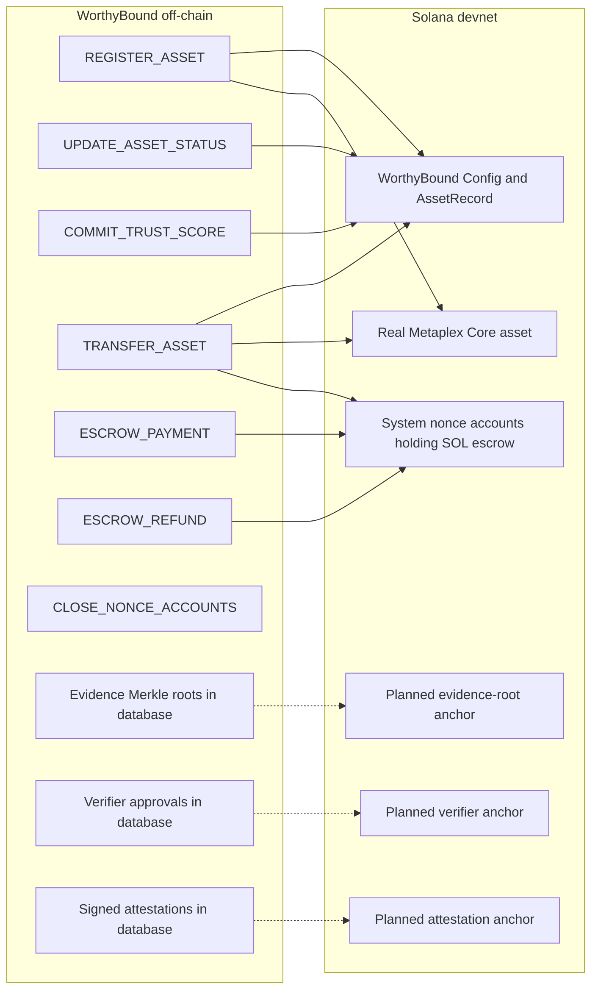
```mermaid
flowchart LR
subgraph Off["WorthyBound off-chain"]
Register["REGISTER_ASSET"]
Status["UPDATE_ASSET_STATUS"]
Trust["COMMIT_TRUST_SCORE"]
Transfer["TRANSFER_ASSET"]
Payment["ESCROW_PAYMENT"]
Refund["ESCROW_REFUND"]
Close["CLOSE_NONCE_ACCOUNTS"]
Evidence["Evidence Merkle roots in database"]
Verifier["Verifier approvals in database"]
Attest["Signed attestations in database"]
end
subgraph On["Solana devnet"]
Record["WorthyBound Config and AssetRecord"]
Token["Real Metaplex Core asset"]
Nonce["System nonce accounts holding SOL escrow"]
FutureEvidence["Planned evidence-root anchor"]
FutureVerifier["Planned verifier anchor"]
FutureAttest["Planned attestation anchor"]
end
Register --> Record
Register --> Token
Status --> Record
Trust --> Record
Transfer --> Record
Transfer --> Token
Evidence -.-> FutureEvidence
Verifier -.-> FutureVerifier
Attest -.-> FutureAttest
Payment --> Nonce
Refund --> Nonce
Transfer --> Nonce
```

Identity and KYC data, files, serial fingerprints, AI results, attestation details, sale decisions, asset, attestation and evidence disputes, hash-chained provenance and audit logs stay off-chain. Defined but unsent kinds are MINT_ASSET, COMMIT_EVIDENCE, APPROVE_VERIFIER, UPDATE_VERIFIER, SUBMIT_ATTESTATION and REVOKE_ATTESTATION. REGISTER_ASSET already creates the record and mints the token. Escrow payment and refund use nonce accounts; no new escrow instruction is added to the WorthyBound program.

## 1 Sign-in and identity

Wallet authentication is built. No KYC provider is integrated yet. A server operator records a wallet's identity status with:

`pnpm kyc:record <wallet> <provider> <reference> [VERIFIED|REJECTED|EXPIRED]`

The wallet must have signed in once. Only the identity status and provider reference are stored, never identity documents. Tokenizing requires VERIFIED.

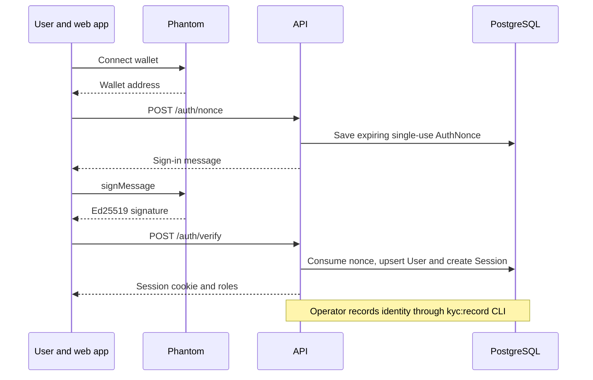
```mermaid
sequenceDiagram
participant User as User and web app
participant Wallet as Phantom
participant API as API
participant DB as PostgreSQL
User->>Wallet: Connect wallet
Wallet-->>User: Wallet address
User->>API: POST /auth/nonce
API->>DB: Save expiring single-use AuthNonce
API-->>User: Sign-in message
User->>Wallet: signMessage
Wallet-->>User: Ed25519 signature
User->>API: POST /auth/verify
API->>DB: Consume nonce, upsert User and create Session
API-->>User: Session cookie and roles
Note over API,DB: Operator records identity through kyc:record CLI
```

ADR 0008 and 0004. Identity states are UNVERIFIED, PENDING, VERIFIED, REJECTED and EXPIRED. Roles are USER, VERIFIER, VERIFIER_REVIEWER and ADMIN. AuthNonce is keyed by wallet address and has no user foreign key.

## 2 Register and publish an asset

Publishing changes DRAFT to ACTIVE. Tokenization has a separate progress field.

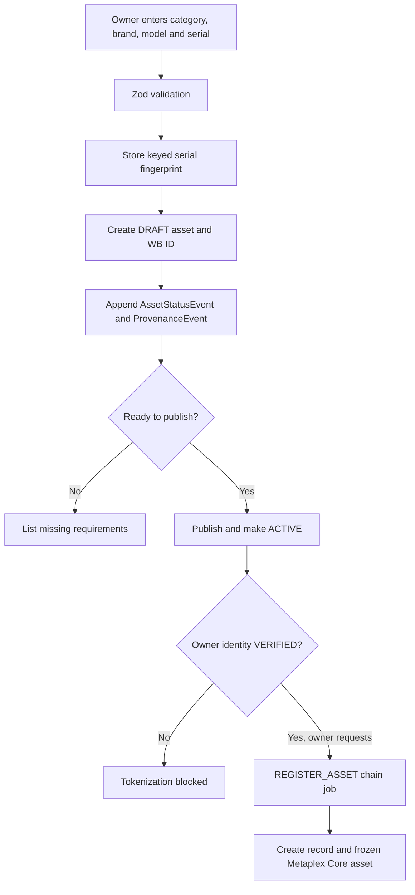
```mermaid
flowchart TD
Owner["Owner enters category, brand, model and serial"] --> Validate["Zod validation"]
Validate --> Fingerprint["Store keyed serial fingerprint"]
Fingerprint --> Draft["Create DRAFT asset and WB ID"]
Draft --> Log["Append AssetStatusEvent and ProvenanceEvent"]
Log --> Ready{"Ready to publish?"}
Ready -->|"No"| Missing["List missing requirements"]
Ready -->|"Yes"| Publish["Publish and make ACTIVE"]
Publish --> Identity{"Owner identity VERIFIED?"}
Identity -->|"No"| Block["Tokenization blocked"]
Identity -->|"Yes, owner requests"| Job["REGISTER_ASSET chain job"]
Job --> Mint["Create record and frozen Metaplex Core asset"]
```

ADR 0009 and 0016. Tokenization progresses separately through NOT_TOKENIZED, PENDING, TOKENIZED or FAILED. The domain status TOKENIZED is a system-controlled lifecycle status; it is not the tokenization progress field. Every status change writes status and provenance events.

## 3a Evidence and guided capture

The Evidence Vault hashes, stores, reviews and groups files. Merkle commitments are already created in the database.

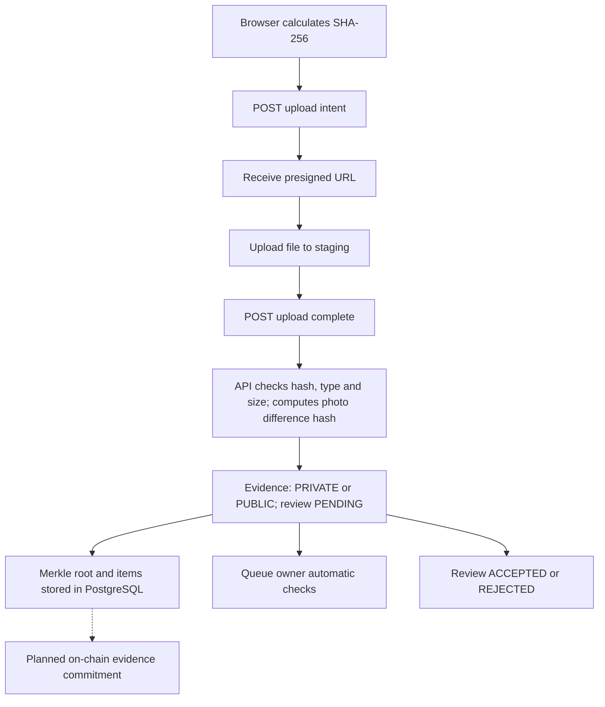
```mermaid
flowchart TD
Browser["Browser calculates SHA-256"] --> Intent["POST upload intent"]
Intent --> URL["Receive presigned URL"]
URL --> Upload["Upload file to staging"]
Upload --> Complete["POST upload complete"]
Complete --> Validate["API checks hash, type and size; computes photo difference hash"]
Validate --> Evidence["Evidence: PRIVATE or PUBLIC; review PENDING"]
Evidence --> Commitment["Merkle root and items stored in PostgreSQL"]
Evidence --> Checks["Queue owner automatic checks"]
Evidence --> Review["Review ACCEPTED or REJECTED"]
Commitment -.-> Planned["Planned on-chain evidence commitment"]
```

ADR 0010 and 0013. Only photos can be public; images of receipts cannot. Evidence types include PHOTO, RECEIPT, CERTIFICATE, PROVENANCE_DOCUMENT, SERIAL_NUMBER, INSPECTION_REPORT, APPRAISAL_DOCUMENT, CONDITION_REPORT, SERVICE_RECORD, OWNERSHIP_DOCUMENT, MANUFACTURER_DOCUMENT, VIDEO and OTHER. Owner evidence capture takes photos only; remote-check sessions also record VIDEO, and shipment sessions include a PACKAGE photo.

## 3b Guided capture purposes

Live-camera capture has three purposes: owner evidence, remote check and shipment. There is no file picker.

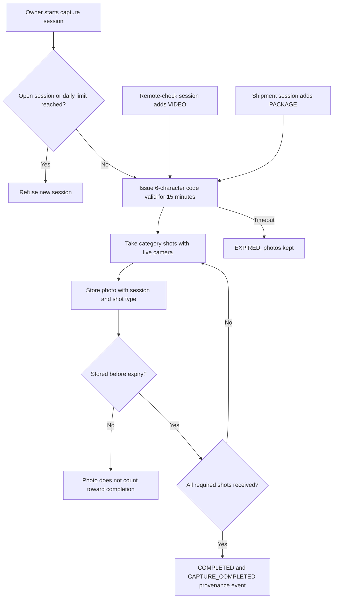
```mermaid
flowchart TD
Start["Owner starts capture session"] --> Limit{"Open session or daily limit reached?"}
Limit -->|"Yes"| Refuse["Refuse new session"]
Limit -->|"No"| Code["Issue 6-character code valid for 15 minutes"]
Code --> Camera["Take category shots with live camera"]
Camera --> Store["Store photo with session and shot type"]
Store --> Time{"Stored before expiry?"}
Time -->|"No"| NotCount["Photo does not count toward completion"]
Time -->|"Yes"| All{"All required shots received?"}
All -->|"No"| Camera
All -->|"Yes"| Complete["COMPLETED and CAPTURE_COMPLETED provenance event"]
Code -->|"Timeout"| Expired["EXPIRED; photos kept"]
Remote["Remote-check session adds VIDEO"] --> Code
Shipment["Shipment session adds PACKAGE"] --> Code
```

ADR 0013. One open session per asset; at most 3 sessions per asset and 10 per owner per day. Codes exclude look-alike characters. Watch shots: DIAL, CASEBACK, CLASP, SERIAL, SIDE, CODE. Art: FRONT, BACK, SIGNATURE, DETAIL, CODE. Jewelry: FRONT, BACK, HALLMARK, CLASP, CODE. Collectible and other: FRONT, BACK, DETAIL, MARKINGS, CODE. Equipment: FRONT, BACK, SERIAL, DETAIL, CODE. Car: FRONT, BACK, SIDE, INTERIOR, VIN, CODE. CODE means the item beside its handwritten code on paper. Owner evidence sessions are photos only. A remote session links purchaseCheckId and adds VIDEO. A shipment session links transferRequestId and adds PACKAGE showing the sealed package with its code. A session cannot link both. These sessions do not count toward owner capture limits, and their photos never become reference photos for other checks. VIDEO evidence is MP4 or QuickTime, at most 100 MiB.

## 4 Automatic checks

Every owner upload is checked once per check version, currently evidence-check-v3. There is no per-item consent step.

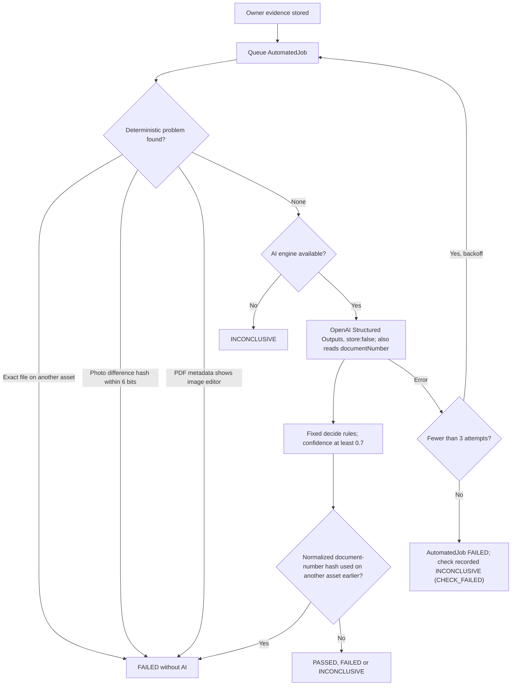
```mermaid
flowchart TD
Evidence["Owner evidence stored"] --> Job["Queue AutomatedJob"]
Job --> Gate{"Deterministic problem found?"}
Gate -->|"Exact file on another asset"| Fail["FAILED without AI"]
Gate -->|"Photo difference hash within 6 bits"| Fail
Gate -->|"PDF metadata shows image editor"| Fail
Gate -->|"None"| Consent{"AI engine available?"}
Consent -->|"No"| Unclear["INCONCLUSIVE"]
Consent -->|"Yes"| AI["OpenAI Structured Outputs, store:false; also reads documentNumber"]
AI --> Decide["Fixed decide rules; confidence at least 0.7"]
Decide --> DocNo{"Normalized document-number hash used on another asset earlier?"}
DocNo -->|"Yes"| Fail
DocNo -->|"No"| Result["PASSED, FAILED or INCONCLUSIVE"]
AI -->|"Error"| Retry{"Fewer than 3 attempts?"}
Retry -->|"Yes, backoff"| Job
Retry -->|"No"| JobFailed["AutomatedJob FAILED; check recorded INCONCLUSIVE (CHECK_FAILED)"]
```

ADR 0013. Deterministic categories are REUSED_FILE, SIMILAR_PHOTO and REUSED_DOCUMENT, plus a deterministic edited-PDF metadata check. A passed check on a photo from a completed guided capture session counts 1.5 times in the Trust Score. The model never decides alone. Owners see only results and problem categories; admins have an AI checks tab. REUSED_DOCUMENT is decided after the AI step: the model returns the document's own number (receipt, invoice, certificate or report number) in its structured output, the worker normalizes it and stores `sha256("document-number:" + number)`, and fails the file if an earlier file on another asset has the same hash. After 3 failed attempts the AutomatedJob ends FAILED (job statuses are PENDING, COMPLETED, FAILED) and the evidence gets an INCONCLUSIVE check with reason CHECK_FAILED. Owner upload checks are mandatory; ITEM_MATCH is a separate job kind for purchase comparisons. Job kinds are EVIDENCE_CHECK, ITEM_MATCH and VERIFIER_REPORT. Without OPENAI_API_KEY the AI part returns INCONCLUSIVE. There are no consent fields for owner upload checks.

## 5 Verifier onboarding

A reviewer decides approval and grants category permissions. AI supplies an advisory report.

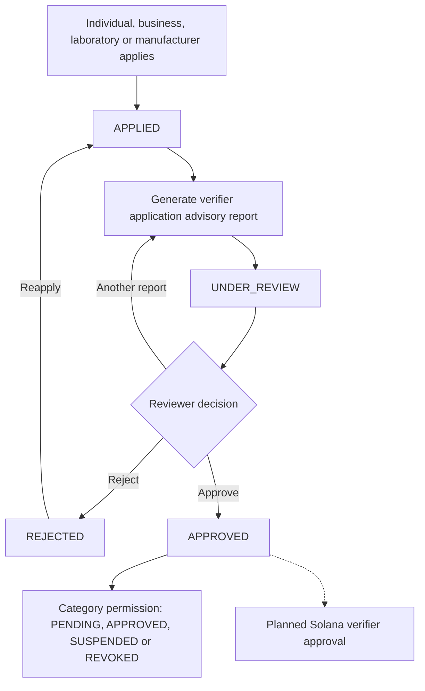
```mermaid
flowchart TD
Apply["Individual, business, laboratory or manufacturer applies"] --> Applied["APPLIED"]
Applied --> AI["Generate verifier application advisory report"]
AI --> Review["UNDER_REVIEW"]
Review --> Decision{"Reviewer decision"}
Decision -->|"Another report"| AI
Decision -->|"Reject"| Rejected["REJECTED"]
Rejected -->|"Reapply"| Applied
Decision -->|"Approve"| Approved["APPROVED"]
Approved --> Categories["Category permission: PENDING, APPROVED, SUSPENDED or REVOKED"]
Approved -.-> Anchor["Planned Solana verifier approval"]
```

ADR 0011. Permissions are granted one category at a time. Verifier approval can be suspended, reinstated or revoked under the status rules. Suspending or revoking a verifier recomputes the Trust Score of every asset they attested; a VERIFIED asset returns to ACTIVE where no template is met any more.

## 6 Verification and attestations

A verifier claims a request, signs the API-built attestation message, and submits the result.

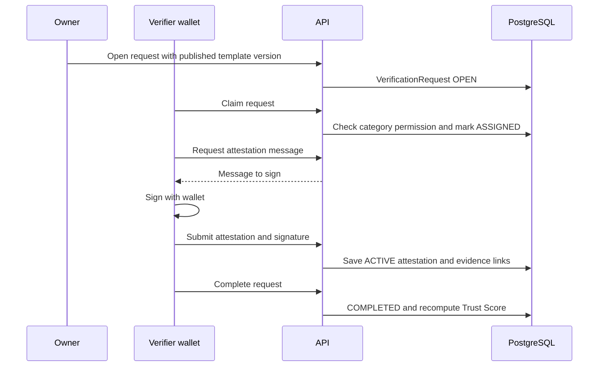
```mermaid
sequenceDiagram
participant Owner as Owner
participant Verifier as Verifier wallet
participant API as API
participant DB as PostgreSQL
Owner->>API: Open request with published template version
API->>DB: VerificationRequest OPEN
Verifier->>API: Claim request
API->>DB: Check category permission and mark ASSIGNED
Verifier->>API: Request attestation message
API-->>Verifier: Message to sign
Verifier->>Verifier: Sign with wallet
Verifier->>API: Submit attestation and signature
API->>DB: Save ACTIVE attestation and evidence links
Verifier->>API: Complete request
API->>DB: COMPLETED and recompute Trust Score
```

ADR 0012. Templates define claims, evidence, methods and minimum verifier counts. Versions are DRAFT, PUBLISHED or RETIRED; published versions are immutable. Requests are OPEN, ASSIGNED, COMPLETED, CANCELLED or EXPIRED. Attestations record claim, CONFIRMED/CONTRADICTED/INCONCLUSIVE result, method, assurance level and evidence hashes. Anchoring attestations on-chain is planned.

## 7a Trust Score and passport

The engine calculates trust from proof sources and saves a reproducible snapshot.

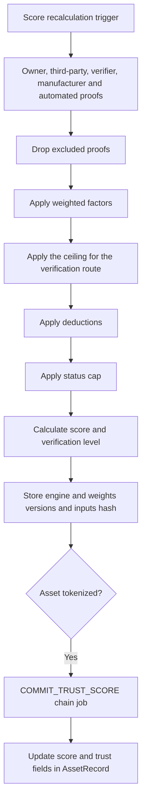
```mermaid
flowchart TD
Trigger["Score recalculation trigger"] --> Proof["Owner, third-party, verifier, manufacturer and automated proofs"]
Proof --> Filter["Drop excluded proofs"]
Filter --> Weights["Apply weighted factors"]
Weights --> Cap["Apply the ceiling for the verification route"]
Cap --> Deductions["Apply deductions"]
Deductions --> StatusCap["Apply status cap"]
StatusCap --> Score["Calculate score and verification level"]
Score --> Snapshot["Store engine and weights versions and inputs hash"]
Snapshot --> Tokenized{"Asset tokenized?"}
Tokenized -->|"Yes"| Chain["COMMIT_TRUST_SCORE chain job"]
Chain --> Record["Update score and trust fields in AssetRecord"]
```

ADR 0003 and 0015. Verification levels are UNVERIFIED, SELF_DOCUMENTED, INSPECTED, AUTHENTICATED and MULTI_VERIFIED.

Ceilings by verification route (engine 1.4.0, weights-2026.5). They are maximums, not automatic scores: evidence quality, confirmed claims, failed checks and other deductions set the actual score.

| Evidence and verification                                   | Maximum Trust Score                                |
| ----------------------------------------------------------- | -------------------------------------------------- |
| Owner evidence only (with KYC)                              | 35 (45)                                            |
| Verifier proofs, but no review of the required claims       | 60 (65 if automated checks passed and none failed) |
| Owner evidence plus passed automated checks, none failed    | 65                                                 |
| One approved verifier reviews online                        | 75                                                 |
| Two independent approved verifiers review online            | 80                                                 |
| One in-person inspection                                    | 85                                                 |
| One online review plus one independent in-person inspection | 90                                                 |
| Two independent approved verifiers inspect in person        | 100                                                |

A review counts only when one approved verifier's valid, signed attestations confirm every required claim of a template the asset is evaluated against, with methods the template allows. IN_PERSON and LABORATORY count as in person; REMOTE and DOCUMENT_REVIEW count as online. Two reviews means two different verifiers. MULTI_VERIFIED requires two independent in-person inspections; online reviews alone cannot unlock it. A score of 100 is the strongest proof under WorthyBound's rules, not a guarantee of authenticity. Failed checks affect trust under the scoring rules. The chain stores score, level, engine and weights versions, inputs hash and trust_seq on the same AssetRecord as ownership and status.

After the ceiling, each open dispute deducts 15 points (at most 30), and status caps apply: DISPUTED 40, REPORTED_LOST 25, REPORTED_STOLEN 10, REVOKED 0. Attestations under dispute are left out until decided, and evidence removed by an upheld dispute no longer counts.

## 7b Public passport

The public passport is read-only and shown only for published assets.

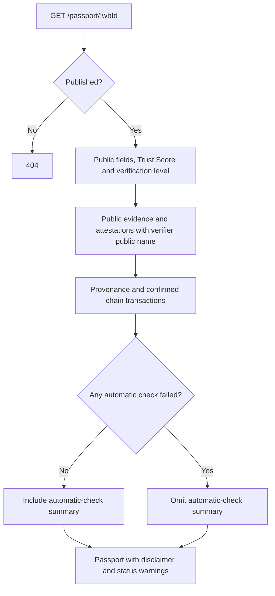
```mermaid
flowchart TD
Request["GET /passport/:wbId"] --> Published{"Published?"}
Published -->|"No"| Missing["404"]
Published -->|"Yes"| Public["Public fields, Trust Score and verification level"]
Public --> Evidence["Public evidence and attestations with verifier public name"]
Evidence --> History["Provenance and confirmed chain transactions"]
History --> Failed{"Any automatic check failed?"}
Failed -->|"No"| Summary["Include automatic-check summary"]
Failed -->|"Yes"| Hide["Omit automatic-check summary"]
Summary --> Passport["Passport with disclaimer and status warnings"]
Hide --> Passport
```

ADR 0009. The standard sentence on the passport, site footer and token metadata is: "A token alone is not proof of authenticity. Independent in-person verification is the strongest proof WorthyBound records." Stolen, lost, disputed and revoked items get a prominent warning. Personal identity and private evidence are not shown. The passport shows the number of open disputes (never the opener, reason or details) and a "Report a problem" card for signed-in users with a verified identity; evidence removed by an upheld dispute is not shown.

Every on-chain address and transaction in the app uses Solscan (devnet) as its main link, with a small Solana Explorer link beside it. This covers the asset token, WorthyBound record, and each transaction shown on the passport and Transfers page.

The Trust Score disclaimer is unchanged: it does not guarantee authenticity, ownership, legal title or value.

## 8 Tokenization

register_asset creates the WorthyBound record and mints a real frozen Metaplex Core asset.

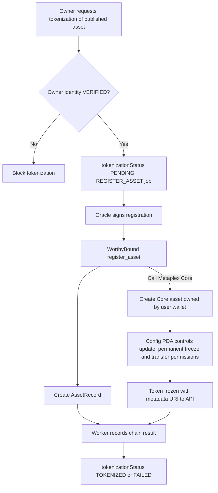
```mermaid
flowchart TD
Request["Owner requests tokenization of published asset"] --> Identity{"Owner identity VERIFIED?"}
Identity -->|"No"| Block["Block tokenization"]
Identity -->|"Yes"| Queue["tokenizationStatus PENDING; REGISTER_ASSET job"]
Queue --> Oracle["Oracle signs registration"]
Oracle --> WB["WorthyBound register_asset"]
WB --> Record["Create AssetRecord"]
WB -->|"Call Metaplex Core"| Core["Create Core asset owned by user wallet"]
Core --> Plugins["Config PDA controls update, permanent freeze and transfer permissions"]
Plugins --> Frozen["Token frozen with metadata URI to API"]
Record --> Result["Worker records chain result"]
Frozen --> Result
Result --> State["tokenizationStatus TOKENIZED or FAILED"]
```

ADR 0009 and 0016. The token name is WorthyBound <WB ID> and its URI is GET /metadata/:wbId. This is a Metaplex Core asset, not an SPL token. The AssetRecord and Core token are separate accounts that refer to the same physical item. Token metadata uses the same standard authenticity sentence as the passport and site footer (7b Public passport). Revocation leaves the token frozen; it does not burn it. An owner-signed burn instruction is planned after the hackathon.

## 9 Status changes

The API applies permission rules and the oracle sends a sequenced update to the WorthyBound program.

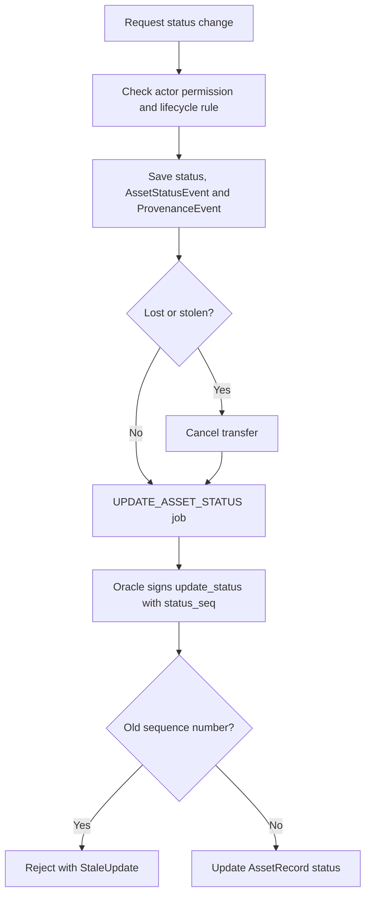
```mermaid
flowchart TD
Request["Request status change"] --> Permission["Check actor permission and lifecycle rule"]
Permission --> Events["Save status, AssetStatusEvent and ProvenanceEvent"]
Events --> Lost{"Lost or stolen?"}
Lost -->|"Yes"| Cancel["Cancel transfer"]
Lost -->|"No"| Update["UPDATE_ASSET_STATUS job"]
Cancel --> Update
Update --> Oracle["Oracle signs update_status with status_seq"]
Oracle --> Chain{"Old sequence number?"}
Chain -->|"Yes"| Reject["Reject with StaleUpdate"]
Chain -->|"No"| Save["Update AssetRecord status"]
```

Reporting lost or stolen also affects an open escrow: a PAID escrow is refunded; a SHIPPED or DELIVERED escrow is held (DISPUTED) for an administrator. ADR 0005, 0016 and 0017. An admin who starts a dispute review with "Hold the item" sets the asset to DISPUTED, which also cancels its open transfer. REVOKED is final. Admins control disputed and revoked statuses and restoration of stolen items.

### Admin revocation

Built on devnet. `POST /admin/assets/:wbId/revoke` requires a reason, at most 500 characters, and works on any asset that is not already revoked.

A draft is discarded. A published passport stays public and is marked "revoked", so old links do not mislead buyers. Nothing is deleted. Revoked assets no longer appear in the owner's "My assets" list.

In the same database transaction, any open transfer is cancelled, open verification requests are cancelled, the status change is recorded in the asset's status and provenance history, an `asset.revoked_by_admin` audit entry is written, and the Trust Score is recalculated. Paid escrow is refunded before shipping; after shipping an administrator decides. The chain sync worker handles the resulting Solana updates and escrow settlement.

If the asset is tokenized, the worker mirrors REVOKED to the on-chain WorthyBound record. The token stays frozen and is not burned. Admins cannot edit an item's facts, including brand, serial or evidence.

The admin web app has an "Items" tab: enter the WB ID and reason, then confirm.

Planned after the hackathon: permanent deletion of files for legal/privacy requests, with an audit record; clearly labelled WorthyBound notes on an item that never change owner data or the Trust Score; and an owner-signed burn instruction in the Solana program.

## 10a Before buying in person

Built on devnet. The buyer checks current owner control and compares live photos.

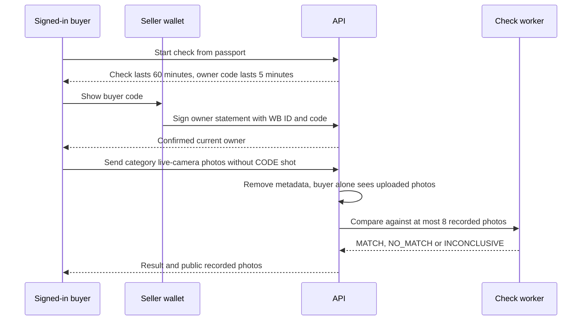
```mermaid
sequenceDiagram
participant Buyer as Signed-in buyer
participant Seller as Seller wallet
participant API as API
participant Checks as Check worker
Buyer->>API: Start check from passport
API-->>Buyer: Check lasts 60 minutes, owner code lasts 5 minutes
Buyer->>Seller: Show buyer code
Seller->>API: Sign owner statement with WB ID and code
API-->>Buyer: Confirmed current owner
Buyer->>API: Send category live-camera photos without CODE shot
API->>API: Remove metadata, buyer alone sees uploaded photos
API->>Checks: Compare against at most 8 recorded photos
Checks-->>API: MATCH, NO_MATCH or INCONCLUSIVE
API-->>Buyer: Result and public recorded photos
```

ADR 0014 is accepted and implemented on devnet; stablecoin payments are planned. One open check per buyer and item; at most 10 per buyer and 10 per item per day. The 5-minute owner code can be renewed. Buyer sees confirmation, never seller wallet or identity. References use verifier photos plus the latest completed owner capture. Inconclusive reasons are no recorded photos, passport revoked, checks unavailable or failed comparison.

## 10b Before buying remotely

Built on devnet. The buyer requests a check; the owner starts the camera session from the open request.

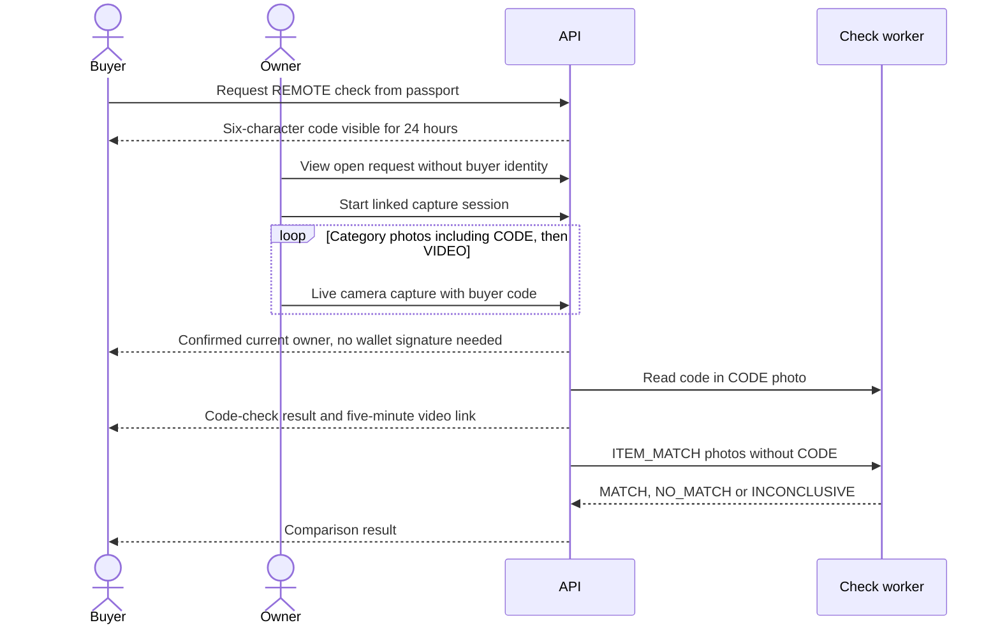
```mermaid
sequenceDiagram
actor Buyer
actor Owner
participant API
participant Checks as Check worker
Buyer->>API: Request REMOTE check from passport
API-->>Buyer: Six-character code visible for 24 hours
Owner->>API: View open request without buyer identity
Owner->>API: Start linked capture session
loop Category photos including CODE, then VIDEO
Owner->>API: Live camera capture with buyer code
end
API-->>Buyer: Confirmed current owner, no wallet signature needed
API->>Checks: Read code in CODE photo
API-->>Buyer: Code-check result and five-minute video link
API->>Checks: ITEM_MATCH photos without CODE
Checks-->>API: MATCH, NO_MATCH or INCONCLUSIVE
API-->>Buyer: Comparison result

```

ADR 0013/0014. One open check per buyer and item, at most three remote checks per item per day, also counted toward daily check limits. The browser records MP4 without sound for at most 60 seconds. The original stays sealed as VIDEO evidence. The buyer receives a copy with metadata boxes blanked through a five-minute link and sees owner.codeCheck. Comparisons use the same recorded-photo and fixed-decision rules as in-person checks.

## 11a Controlled transfer with SOL payment

Buyer identity and asset eligibility are checked before the sale proceeds.

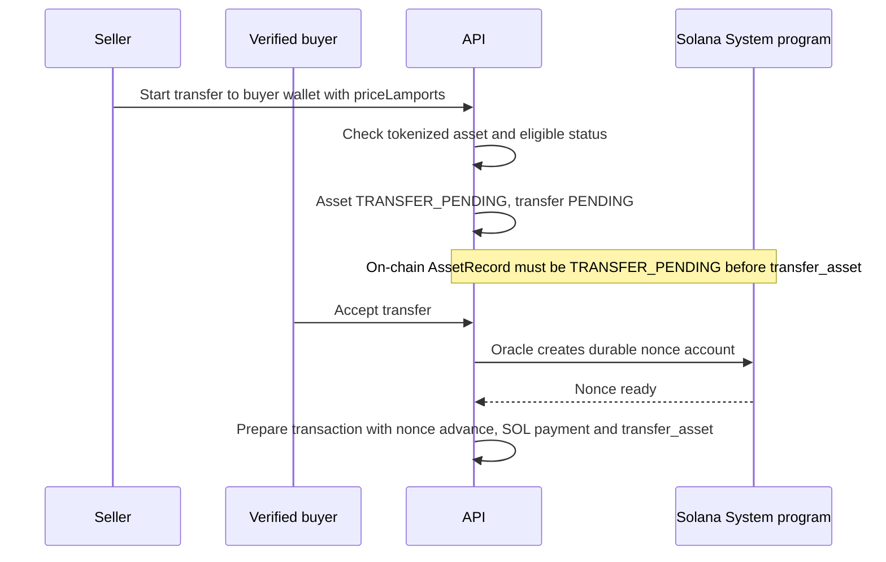
```mermaid
sequenceDiagram
participant Seller as Seller
participant Buyer as Verified buyer
participant API as API
participant System as Solana System program
Seller->>API: Start transfer to buyer wallet with priceLamports
API->>API: Check tokenized asset and eligible status
API->>API: Asset TRANSFER_PENDING, transfer PENDING
Note over API,System: On-chain AssetRecord must be TRANSFER_PENDING before transfer_asset
Buyer->>API: Accept transfer
API->>System: Oracle creates durable nonce account
System-->>API: Nonce ready
API->>API: Prepare transaction with nonce advance, SOL payment and transfer_asset
```

ADR 0002 and ADR 0014. Buyer must be signed in and VERIFIED. Asset must be tokenized and ACTIVE, VERIFIED or REVERIFICATION_REQUIRED. Price is in lamports, with zero meaning no payment. The nonce is created on acceptance, with the oracle as authority. Delivery is fixed at start: IN_PERSON or SHIPPED. This page describes IN_PERSON.

## 11b Controlled transfer signatures and completion

Both wallets sign the exact same prepared transaction; the oracle adds its signature last.

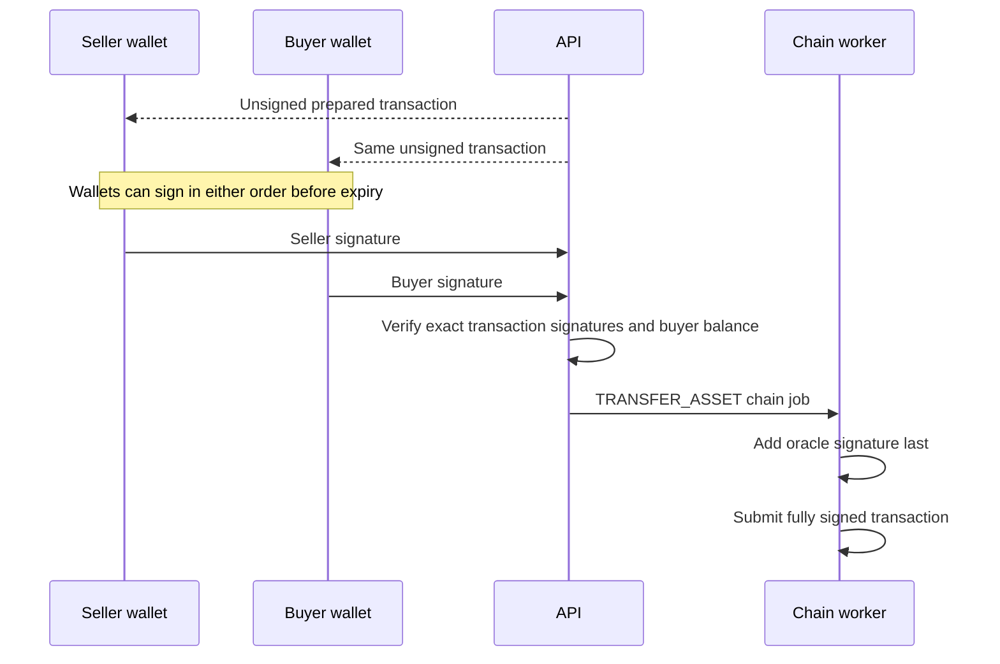
```mermaid
sequenceDiagram
participant Seller as Seller wallet
participant Buyer as Buyer wallet
participant API as API
participant Worker as Chain worker
API-->>Seller: Unsigned prepared transaction
API-->>Buyer: Same unsigned transaction
Note over Seller,Buyer: Wallets can sign in either order before expiry
Seller->>API: Seller signature
Buyer->>API: Buyer signature
API->>API: Verify exact transaction signatures and buyer balance
API->>Worker: TRANSFER_ASSET chain job
Worker->>Worker: Add oracle signature last
Worker->>Worker: Submit fully signed transaction
```

TransferRequest stores statusBefore, closedReason, unsigned base64 transaction, nonceAccount, statusSeq, priceLamports, sellerSignature and buyerSignature. The oracle signature does not replace either wallet signature. Delivery is fixed at start: IN_PERSON or SHIPPED. This page describes IN_PERSON.

## 11c Controlled transfer execution and completion

SOL payment and token transfer execute in one transaction. Both the AssetRecord and Core asset must belong to the seller.

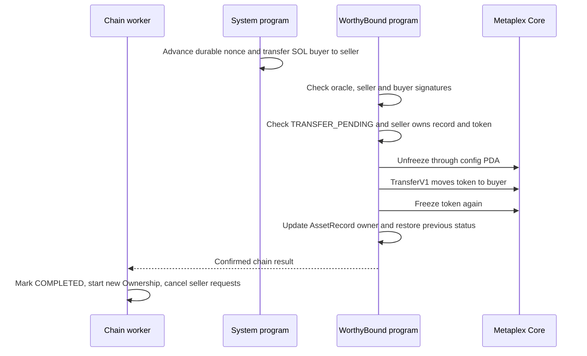
```mermaid
sequenceDiagram
participant Worker as Chain worker
participant System as System program
participant WB as WorthyBound program
participant Core as Metaplex Core
System->>System: Advance durable nonce and transfer SOL buyer to seller
WB->>WB: Check oracle, seller and buyer signatures
WB->>WB: Check TRANSFER_PENDING and seller owns record and token
WB->>Core: Unfreeze through config PDA
WB->>Core: TransferV1 moves token to buyer
WB->>Core: Freeze token again
WB->>WB: Update AssetRecord owner and restore previous status
WB-->>Worker: Confirmed chain result
Worker->>Worker: Mark COMPLETED, start new Ownership, cancel seller requests
```

The payment happens through a System transfer in the same transaction as transfer_asset, so purchase payment and token movement succeed together or roll back together. Network fees and nonce advancement can still occur on execution failure. Reject, cancel or expire restore the asset status; lost or stolen reporting cancels the transfer. Current payments are SOL on devnet. Shipped-item SOL escrow is built and described separately. Delivery is fixed at start: IN_PERSON or SHIPPED. This page describes IN_PERSON.

### Payments: on-chain settlement and planned currencies

Payments settle on Solana, with the purchase payment atomic with the ownership transfer. No card processor is needed by WorthyBound.

Built: SOL on devnet. In-person sales use one transaction that pays the seller and moves the token; durable nonces let both sides sign minutes or days apart. Shipped items use SOL escrow released after a receipt check, with release payment and token movement in the same transaction.

Planned, in order: USDC, then EURC, then a Canadian dollar stablecoin chosen based on availability and liquidity on Solana. SOL remains an option. Buyers without crypto get USDC through their wallet's card on-ramp, for example Phantom; this is the wallet's on-ramp, not a WorthyBound card processor. WorthyBound's own fees, such as publishing a passport, can also be paid on-chain under the payment plan. These currency and fee-payment additions are planned, not built.

Running escrow with real money on mainnet requires legal review first.

## 12 Chain worker and provenance

The worker submits seven built transaction kinds, checks escrow deadlines on every tick, and records off-chain history.

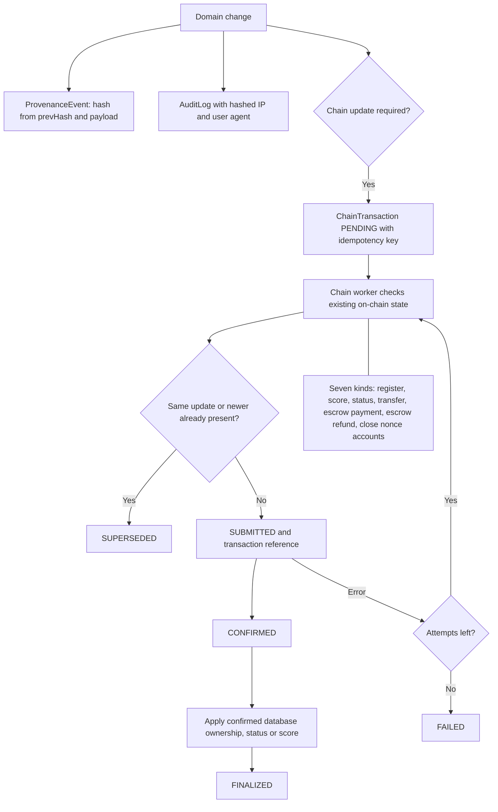
```mermaid
flowchart TD
Domain["Domain change"] --> Provenance["ProvenanceEvent: hash from prevHash and payload"]
Domain --> Audit["AuditLog with hashed IP and user agent"]
Domain --> Needed{"Chain update required?"}
Needed -->|"Yes"| Pending["ChainTransaction PENDING with idempotency key"]
Pending --> Worker["Chain worker checks existing on-chain state"]
Worker --> Newer{"Same update or newer already present?"}
Newer -->|"Yes"| Superseded["SUPERSEDED"]
Newer -->|"No"| Send["SUBMITTED and transaction reference"]
Send --> Confirm["CONFIRMED"]
Confirm --> Apply["Apply confirmed database ownership, status or score"]
Apply --> Final["FINALIZED"]
Send -->|"Error"| Retry{"Attempts left?"}
Retry -->|"Yes"| Worker
Retry -->|"No"| Failed["FAILED"]
Worker --- Kinds["Seven kinds: register, score, status, transfer, escrow payment, escrow refund, close nonce accounts"]
```

ADR 0005 and 0016. ChainTransaction targets use entityType and entityId, including ASSET and TRANSFER_REQUEST. Provenance and audit logs are off-chain. If the chain succeeded and the database update failed, complete the database update rather than paying again. Rate limits protect per-user write routes. Sent kinds: REGISTER_ASSET, COMMIT_TRUST_SCORE, UPDATE_ASSET_STATUS, TRANSFER_ASSET, ESCROW_PAYMENT, ESCROW_REFUND and CLOSE_NONCE_ACCOUNTS (closes the nonce accounts of ended transfers and returns their rent to the oracle). runEscrowDeadlines applies shipment, delivery and release deadlines. Open in-person transfers expire when read or acted on.

## Asset states

Lifecycle transitions from packages/shared/src/lifecycle.ts.

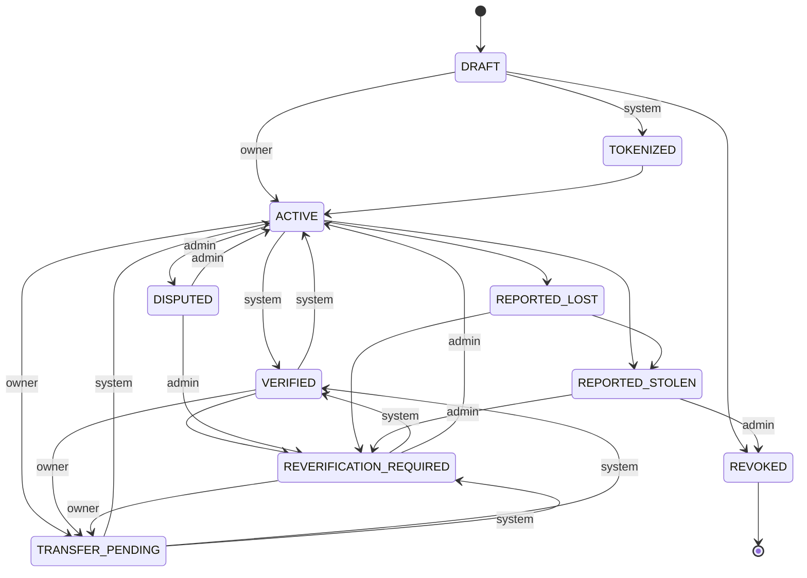
```mermaid
stateDiagram-v2
  [*] --> DRAFT
  DRAFT --> TOKENIZED: system
  DRAFT --> ACTIVE: owner
  DRAFT --> REVOKED
  TOKENIZED --> ACTIVE
  ACTIVE --> VERIFIED: system
  VERIFIED --> ACTIVE: system
  VERIFIED --> REVERIFICATION_REQUIRED
  ACTIVE --> TRANSFER_PENDING: owner
  VERIFIED --> TRANSFER_PENDING: owner
  REVERIFICATION_REQUIRED --> TRANSFER_PENDING: owner
  TRANSFER_PENDING --> ACTIVE: system
  TRANSFER_PENDING --> VERIFIED: system
  TRANSFER_PENDING --> REVERIFICATION_REQUIRED: system
  REVERIFICATION_REQUIRED --> VERIFIED: system
  REVERIFICATION_REQUIRED --> ACTIVE: admin
  ACTIVE --> DISPUTED: admin
  DISPUTED --> ACTIVE: admin
  DISPUTED --> REVERIFICATION_REQUIRED: admin
  ACTIVE --> REPORTED_LOST
  ACTIVE --> REPORTED_STOLEN
  REPORTED_LOST --> REPORTED_STOLEN
  REPORTED_LOST --> REVERIFICATION_REQUIRED
  REPORTED_STOLEN --> REVERIFICATION_REQUIRED: admin
  REPORTED_STOLEN --> REVOKED: admin
  REVOKED --> [*]

```

TOKENIZED is system-controlled. Publishing moves DRAFT to ACTIVE; tokenizationStatus tracks chain progress separately. Lost, stolen, disputed and revoked states can be reached from most statuses under actor permissions. REVOKED is final. The built admin revocation action can revoke any asset that is not already revoked; the diagram above summarizes the existing lifecycle paths rather than enumerating every admin-revocation path. Drafts are discarded without deleting records; published revoked passports stay public with a warning.

## Transfer states

Transfer request states and blockchain progress remain separate.

```mermaid
flowchart TD
Pending["PENDING"] -->|"Recipient"| Accepted["ACCEPTED"]
Pending -->|"Recipient"| Rejected["REJECTED"]
Pending --> Cancelled["CANCELLED"]
Pending --> Expired["EXPIRED"]
Accepted -->|"System after chain confirmation"| Completed["COMPLETED"]
Accepted --> Cancelled
Accepted --> Expired
subgraph Chain["Separate ChainTransaction states"]
Wait["PENDING"] --> Sent["SUBMITTED"]
Sent --> Confirm["CONFIRMED"]
Confirm --> Final["FINALIZED"]
Wait --> Superseded["SUPERSEDED: same or newer chain update"]
Sent --> Failed["FAILED"]
end
```

Recipient accepts or rejects PENDING. Sender, admin or system can cancel PENDING. Either party, admin or system can cancel ACCEPTED under applicable guards. Completion is recorded by the system after confirmation. Guards after signing: an in-person transfer cannot be cancelled once both parties have signed and the TRANSFER_ASSET job exists, unless that job has FAILED after its last attempt; signed transfers do not expire. For SHIPPED transfers, once paid the seller can cancel (with refund) only while PAID, and the buyer only while SHIPPED after the delivery due date; other cancellations are refused.

## Escrow states

escrowStatus is a separate track from TransferRequest.status and ChainTransaction.status.

```mermaid
stateDiagram-v2
  [*] --> AWAITING_PAYMENT: buyer accepts
  AWAITING_PAYMENT --> PAID: payment confirmed
  PAID --> SHIPPED: seller ships
  PAID --> REFUNDING: not shipped in 3 days / seller cancels
  SHIPPED --> DELIVERED: buyer confirms
  SHIPPED --> DISPUTED: buyer reports a problem
  SHIPPED --> REFUNDING: buyer cancels after delivery period
  SHIPPED --> RELEASING: no confirmation, 7 days after period
  DELIVERED --> RELEASING: receipt MATCH / 7 days
  DELIVERED --> DISPUTED: NO_MATCH / buyer reports
  DISPUTED --> RELEASING: admin RELEASE
  DISPUTED --> REFUNDING: admin REFUND
  RELEASING --> RELEASED: TRANSFER_ASSET confirmed
  REFUNDING --> REFUNDED: ESCROW_REFUND confirmed
  RELEASED --> [*]
  REFUNDED --> [*]
```

RELEASED means transfer COMPLETED; REFUNDED means transfer CANCELLED. Escrow disputes are sale decisions, separate from the Dispute model for assets, attestations and evidence (ADR 0017).

## Verifier states

Lifecycle transitions from packages/shared/src/lifecycle.ts.

```mermaid
stateDiagram-v2
  [*] --> APPLIED
  APPLIED --> UNDER_REVIEW
  APPLIED --> REJECTED
  UNDER_REVIEW --> APPROVED
  UNDER_REVIEW --> REJECTED
  APPROVED --> SUSPENDED
  SUSPENDED --> APPROVED
  APPROVED --> REVOKED: admin
  SUSPENDED --> REVOKED: admin
  REJECTED --> APPLIED: reapply
  REVOKED --> [*]

```

An approved verifier can be suspended and reinstated. Rejected applicants may reapply. Admin revocation is final.

## Attestation lifecycle

Lifecycle transitions from packages/shared/src/lifecycle.ts.

```mermaid
stateDiagram-v2
  [*] --> ACTIVE
  ACTIVE --> EXPIRED
  ACTIVE --> SUPERSEDED
  ACTIVE --> DISPUTED: admin
  ACTIVE --> REVOKED
  EXPIRED --> SUPERSEDED
  EXPIRED --> DISPUTED
  EXPIRED --> REVOKED
  DISPUTED --> ACTIVE: admin
  DISPUTED --> EXPIRED
  DISPUTED --> REVOKED: admin
  SUPERSEDED --> [*]
  REVOKED --> [*]

```

The signed report stays immutable. Status events record expiry, supersession, dispute and revocation. SUPERSEDED and REVOKED are final; disputed attestations can return to ACTIVE or EXPIRED under the rules.

## Connected records for people and ownership

Ownership.transferRequestId links a custody period to the transfer that started it.

```mermaid
erDiagram
User ||--o{ Session : has
User ||--o{ RoleAssignment : has
User ||--o{ Asset : owns
User ||--o{ Ownership : holds
User ||--o{ TransferRequest : sends
User |o--o{ TransferRequest : receives
Asset ||--o{ AssetStatusEvent : logs
Asset ||--o{ Ownership : custody
Asset ||--o{ TransferRequest : has
TransferRequest |o--o| Ownership : starts
```

AuthNonce is keyed by wallet address and has no foreign key. IdempotencyKey is also part of the users-and-access model. ChainTransaction uses a polymorphic entityType/entityId target; a direct Asset foreign key is not assumed.

## Connected records for evidence and checks

Use the actual model names AutomatedJob and AutomatedCheck.

```mermaid
erDiagram
User ||--o{ Evidence : uploads
User ||--o{ CaptureSession : starts
User ||--o{ PurchaseCheck : buys
Asset ||--o{ Evidence : has
Asset ||--o{ EvidenceCommitment : has
Asset ||--o{ CaptureSession : has
Asset ||--o{ PurchaseCheck : has
Asset ||--o{ AutomatedCheck : has
EvidenceCommitment ||--o{ EvidenceCommitmentItem : contains
Evidence ||--o{ EvidenceCommitmentItem : included
CaptureSession |o--o{ Evidence : produces
Evidence ||--o{ AutomatedCheck : checked
PurchaseCheck ||--o{ PurchaseCheckPhoto : has
PurchaseCheck |o--o{ CaptureSession : remote_capture
TransferRequest |o--o{ CaptureSession : shipment_capture
TransferRequest |o--o| PurchaseCheck : receipt_check
```

EvidenceUpload tracks upload intent and completion. AutomatedJob tracks background attempts. These entities are present in the schema; only specified foreign keys are drawn. Merkle roots and included file links are stored in the database. PurchaseCheck kinds are IN_PERSON, REMOTE and RECEIPT. Only RECEIPT links transferRequestId. CaptureSession links a remote purchase check or a shipment transfer, never both.

## Connected records for verification trust and history

Templates, permission events and signed reports explain the proofs behind trust.

```mermaid
erDiagram
User ||--o| Verifier : applies_as
Verifier ||--o{ VerifierCategoryPermission : granted
Verifier ||--o{ VerifierStatusEvent : logs
Verifier ||--o{ VerifierApplicationReport : reports
Verifier |o--o{ VerificationRequest : assigned
Verifier ||--o{ Attestation : issues
VerificationTemplate ||--o{ VerificationTemplateVersion : versions
VerificationTemplateVersion ||--o{ VerificationRequest : uses
VerificationTemplateVersion ||--o{ Attestation : uses
VerificationRequest ||--o{ Attestation : yields
Attestation ||--o{ AttestationEvidence : cites
Evidence ||--o{ AttestationEvidence : cited
Attestation ||--o{ AttestationStatusEvent : logs
Attestation |o--o| Attestation : supersedes
Attestation |o--o{ Dispute : targeted
Evidence |o--o{ Dispute : targeted
Asset ||--o{ Dispute : disputed
User ||--o{ Dispute : opens_reviews_resolves
Asset ||--o{ TrustScoreSnapshot : has
Asset ||--o{ ProvenanceEvent : chain
```

Additional schema entities are VerifierCategoryPermissionEvent, VerificationRequestStatusEvent and AuditLog. Disputes have API routes, an admin Disputes tab and a passport "Report a problem" card (ADR 0017). Trust snapshots retain engine/weights versions and the inputs hash.

## The oracle

The oracle is an authorized server key. The config PDA is a different account that controls token permissions.

```mermaid
flowchart TD
Approved["API approves built chain action"] --> Worker["Chain worker prepares instruction"]
Worker --> Oracle["Oracle key stored as a Render secret file"]
Oracle --> WB["WorthyBound program checks configured oracle signature"]
WB --> Record["Update WorthyBound AssetRecord"]
WB --> Config["Config PDA signs program calls to Metaplex Core"]
Config --> Core["Core update, freeze and transfer permissions"]
Seller["Seller wallet signature"] --> Transfer["Controlled transfer requires all three signatures"]
Buyer["Buyer wallet signature"] --> Transfer
Oracle --> Transfer
Transfer --> WB
```

ADR 0016. Server setting SOLANA_TRUST_ORACLE_KEYPAIR_PATH points to the oracle keypair. The oracle is not the token owner and is not the config PDA. The program exposes initialize, set_oracle, set_paused, register_asset, update_status, commit_trust_score and transfer_asset. set_oracle and set_paused are admin-only instructions. An operator command for set_oracle (`devnet.mjs set-oracle`) is built; rotating the oracle also means replacing the Render secret file. For SHIPPED delivery, the oracle creates both the escrow/transfer nonce and the payment nonce. It signs escrow withdrawals, release and refund transactions. It controls the escrow nonce authority; it is distinct from the token owner and config PDA.

## On-chain accounts

Two programs own the two account types; the user wallet owns the token.

```mermaid
flowchart TD
Item["Physical item with WB ID"] --> Record["AssetRecord account: owned by WorthyBound program"]
Item --> Token["Core asset account: owned by Metaplex Core program"]
Record --> Fields["Wallet owner, status, sequences, score, level, versions, inputs hash, transfer count"]
Token --> Wallet["Token owner field: user wallet"]
Token --> URI["Name WorthyBound WB ID and URI /metadata/:wbId"]
Token --> Authority["Update authority: WorthyBound config PDA"]
Authority --> Freeze["PermanentFreezeDelegate: frozen true"]
Authority --> Transfer["PermanentTransferDelegate controlled by config PDA"]
```

The account program owner is the program allowed to change account data; the token owner is the wallet recorded as holding the asset. Metaplex Core owns the token account data. WorthyBound owns its AssetRecord data and calls Core through the config PDA. The owner cannot directly move or sell the frozen token elsewhere; WorthyBound controls the approved transfer path. Addresses are program-derived (PDAs of the WorthyBound program): Config from seeds ["config"], AssetRecord from ["asset", WB ID], and the Core asset from ["core", WB ID], so each WB ID has exactly one record and one token address. Exact binary layouts are in the Anchor IDL and the generated client in packages/solana.

## Program identities and operational configuration

Public addresses and configuration roles are listed below. These are public keys, not secret key material.

WorthyBound program ID: 5stfBCcoD9mpW3514ycoKZBQ4Xzav3KpbZHTC9AUGMem

Configured oracle address: 9esZTKsmpKUBTDj6no3iHgLa51bvXoyTF6APqqUNyG5b

Configured admin address: 4WFo2nZ5eqWqnstZupSt6oqq6tN2MTM4C2ARixHrWfmv

Metaplex Core program: CoREENxT6tW1HoK8ypY1SxRMZTcVPm7R94rH4PZNhX7d

Render keeps the oracle keypair as a secret file. API settings cover database, session, auth domain, serial fingerprint key, Solana RPC/WebSocket URLs, program ID, oracle path, public API URL, web distribution path and OpenAI key/model.

## Who owns the watch and who controls the account

The word owner has two meanings on Solana. This example separates them.

```mermaid
flowchart LR
Wallet["Your wallet owns the watch token"] --> Token["Metaplex Core asset"]
Core["Metaplex Core program controls token account data"] --> Token
WB["WorthyBound program controls AssetRecord data"] --> Record["Item record"]
Config["WorthyBound config PDA holds token permissions"] --> Token
Token --> Same["Both records describe the same WB ID"]
Record --> Same
```

Owning the token does not give the user unrestricted transfer rights. The token is frozen. The config PDA authorizes the controlled Core operation, and the WorthyBound program requires oracle, seller and buyer signatures before it moves the token.

## Durable nonce and atomic payment

IN_PERSON uses one nonce; SHIPPED uses two. The oracle is nonce authority.

```mermaid
flowchart TD
Accept["Verified buyer accepts"] --> Nonce["System Program nonce account; oracle authority"]
Nonce --> Prepared["Prepare exact transaction"]
Prepared --> Advance["AdvanceNonceAccount instruction"]
Advance --> Pay["System transfer: buyer pays seller in SOL"]
Pay --> Transfer["WorthyBound transfer_asset"]
Transfer --> Core["Config PDA unfreezes, TransferV1 moves, then refreezes Core token"]
Core --> Record["Update record owner, restore status"]
Record --> Atomic["Purchase payment and token move succeed together"]
```

The stored nonce removes the recent-blockhash time limit while wallet signatures are collected; transfer expiry still applies. A consumed transaction cannot run twice. Execution failure can still charge fees and advance the nonce. Read chain results before retrying. The oracle is the fee payer for transfer transactions and pays the rent for each nonce account (about 0.00106 SOL). A CLOSE_NONCE_ACCOUNTS chain job closes them once the transfer has ended and nothing is still held, returning the rent to the oracle. For shipped items, the transfer nonce account also holds the buyer’s price, and a second nonce is used for payment. Release withdraws from escrow to the seller in the same transaction as token movement. Refund returns the price and advances the escrow nonce to invalidate the signed sale. No WorthyBound program change is required.

## Record safeguards

PostgreSQL enforces integrity alongside API permissions and write-route rate limits.

```mermaid
flowchart TD
Action["API or operator action"] --> Rules["PostgreSQL integrity triggers and constraints"]
Rules --> History["Append-only history and provenance hash chain"]
Rules --> Attest["Attestation authority and immutable reports"]
Rules --> Template["Immutable published templates"]
Rules --> Nonce["Single-use login nonce"]
Rules --> Index["Check constraints and partial unique indexes"]
Action --> Audit["Audit log with hashed IP and user agent"]
Action --> Rate["Per-user rate limits on write routes"]
Dispute["Dispute OPEN"] --> Review["UNDER_REVIEW"]
Review --> Outcome["UPHELD or REJECTED (admin)"]
Dispute --> Early["REJECTED (admin) or WITHDRAWN (opener)"]
```

ADR 0005 and 0017. Asset, attestation and evidence disputes are built with database integrity checks; the opener can withdraw only until an admin starts the review. Escrow sale disputes have built API and admin decisions at /admin/escrow. Templates and attestations preserve originals. The admin module provides roles, templates, AI-check review, disputes, escrow decisions and the built Items tab for revocation. Revocation writes an asset.revoked_by_admin audit entry; admins cannot edit item facts or evidence. Nothing is deleted by revocation.

## 13a Shipped-item SOL escrow

Built on devnet. Buyer funds are held in the transfer nonce account; the token stays frozen with the seller until release.

```mermaid
sequenceDiagram
actor Seller
actor Buyer
participant API
participant Worker
participant Solana
Seller->>API: Start SHIPPED transfer with price
Buyer->>API: Accept
API->>Solana: Create escrow nonce and payment nonce
Seller->>API: Sign prepared sale transaction
Buyer->>API: Sign prepared sale transaction
Note over API,Worker: Hold signed sale, do not send yet
Buyer->>API: Sign price payment into escrow
API->>Worker: ESCROW_PAYMENT
Worker->>Solana: Send payment
Worker-->>API: PAID, seller has three days to ship
Seller->>API: Shipment capture and carrier/tracking
API-->>Buyer: SHIPPED, 21-day delivery period
Buyer->>API: Confirm delivery
API-->>Buyer: DELIVERED, 48-hour receipt check

```

ADR 0002/0014. Delivery can be extended by seven days at a time, at most three times. Shipment capture includes the item and sealed PACKAGE with the code. The receipt check photographs the package with the seller’s code, then the item, and compares with pre-shipment photos. Transfer signatures can arrive in either order. Payment and transfer have separate nonce accounts; the transfer nonce also holds the escrow price.

## 13b Escrow release refund and deadlines

Receipt checks and the chain worker determine whether to release, refund or hold for an administrator.

```mermaid
flowchart TD
Receipt["Receipt comparison"] --> Result{"Result"}
Result -->|"MATCH"| Release["RELEASING: send signed TRANSFER_ASSET"]
Result -->|"NO_MATCH"| Dispute["DISPUTED: administrator decision"]
Problem["Buyer reports problem while SHIPPED or DELIVERED"] --> Dispute
Dispute -->|"RELEASE"| Release
Dispute -->|"REFUND"| Refund["REFUNDING: ESCROW_REFUND"]
Release --> Done["RELEASED and transfer COMPLETED"]
Refund --> Back["Return price, advance escrow nonce"]
Back --> Cancel["REFUNDED and transfer CANCELLED"]
Deadlines["Chain worker checks deadlines every tick"] -->|"Not shipped in three days"| Refund
Deadlines -->|"Seven days after delivery or delivery period"| Release
Before["Seller cancels before shipping"] --> Refund
Failed["Sale transaction could not be sent"] --> Hold["Administrator hold, refund only"]
Hold --> Refund

```

Ordering after the delivery period: from deliveryDueAt until deliveryDueAt + 7 days the buyer can cancel with a refund, extend (each extension adds 7 days from the later of the due date and now, at most 3), confirm delivery or report a problem. If the escrow is still SHIPPED at deliveryDueAt + 7 days, runEscrowDeadlines releases the sale. After delivery is confirmed, releaseAt is deliveredAt + 7 days. Lost/stolen reporting refunds paid escrow before shipping and holds it for an administrator after shipping. If payment confirmation fails, the worker advances the payment nonce before giving up, then checks the escrow balance: record payment if funded or ask the buyer to sign again. Refund voids the old signed transfer. The seven-day release clock is measured from delivery or the end of the delivery period, as applicable.

## Open items

- Stablecoin payments: USDC, then EURC, then a Canadian dollar stablecoin to be chosen.
- Integration of an identity-verification (KYC) provider.
- Legal review before real-money escrow on mainnet.
- Mainnet deployment.
- On-chain anchors for evidence, verifiers and attestations.
- Verifier-fitted NFC tags.

## Implementation status and next steps

Built: registration, passports, Evidence Vault and database Merkle roots; owner photo capture, remote video capture and shipment package capture; mandatory owner AI checks; verifier and signed-attestation workflows; Trust Score; frozen Metaplex Core token; controlled in-person SOL payment; in-person and remote purchase checks; shipped-item SOL escrow, receipt checks, deadlines and admin sale decisions; admin asset revocation and the Items tab; Solscan devnet links with secondary Solana Explorer links; standard authenticity wording on the passport, footer and token metadata, and updated landing-page positioning. Identity status is recorded through the operator KYC command; no KYC provider is integrated and no identity documents are stored.

### Devnet proof transactions

- Smoke (WB-034B017E): register, trust score, status update, an unpaid sale rejected, then a durable-nonce sale signed before the blockhash expired that paid the seller 0.01 SOL. [transfer_asset with payment](https://solscan.io/tx/3bV72b7jEpLZS1CxbZJtyggAsihgk28XvJ6ngREXQoMxNZa7QnxFgz6M3TDq315mpxUMuCcxNHyWKhMxJrBP41Pq?cluster=devnet) ([Explorer](https://explorer.solana.com/tx/3bV72b7jEpLZS1CxbZJtyggAsihgk28XvJ6ngREXQoMxNZa7QnxFgz6M3TDq315mpxUMuCcxNHyWKhMxJrBP41Pq?cluster=devnet))
- Escrow release (WB-89451C12): an abandoned payment was rejected after the reset; [payment into escrow](https://solscan.io/tx/2GyvNETD89QN8oDVCJwiFA3trSmpwCx4bRSXP4oueroDKLZ7Y9GHH7wP1keWGuPFDNRmbEy1FDBgpfEYKvCqH4zC?cluster=devnet) ([Explorer](https://explorer.solana.com/tx/2GyvNETD89QN8oDVCJwiFA3trSmpwCx4bRSXP4oueroDKLZ7Y9GHH7wP1keWGuPFDNRmbEy1FDBgpfEYKvCqH4zC?cluster=devnet)), then [transfer_asset from escrow](https://solscan.io/tx/2dUAusJKENCr3EecMrNCg75AbvuxKZUpxicFw1xbz9GNWttGPZHP1rcWUmcYmefke4CrDcpTDSws77ypyHYbvfkq?cluster=devnet) ([Explorer](https://explorer.solana.com/tx/2dUAusJKENCr3EecMrNCg75AbvuxKZUpxicFw1xbz9GNWttGPZHP1rcWUmcYmefke4CrDcpTDSws77ypyHYbvfkq?cluster=devnet)) paid the seller and moved the token.
- Escrow refund (WB-AB64B111): [payment](https://solscan.io/tx/66AwyDMiSCFnTJnAQ2712SypeVaETN6L4yHGFzn5bMU8YTv12iPaLVF1jYmyaNWcjzy3wZ7y76J9VCEh2UNoP7Lz?cluster=devnet) ([Explorer](https://explorer.solana.com/tx/66AwyDMiSCFnTJnAQ2712SypeVaETN6L4yHGFzn5bMU8YTv12iPaLVF1jYmyaNWcjzy3wZ7y76J9VCEh2UNoP7Lz?cluster=devnet)) and [refund](https://solscan.io/tx/3EZunqBDqYYTE5cojKT5PzzzA8beMhPQCkjEYYv9RQeJugic4kiX3net3vui1hP5WDm7gWMbTpu2ZbrHYSoHuoc7?cluster=devnet) ([Explorer](https://explorer.solana.com/tx/3EZunqBDqYYTE5cojKT5PzzzA8beMhPQCkjEYYv9RQeJugic4kiX3net3vui1hP5WDm7gWMbTpu2ZbrHYSoHuoc7?cluster=devnet)); the prepared sale can no longer run.
- Nonce rent recovery: the three nonce accounts from these runs were [closed in one transaction](https://solscan.io/tx/5tUQHjtPNzLr7YwZf5dgrWwCdLSAvCvKguNdr2KMshxWMHiC5Pv5z8EEmv1iXkDpj6LWNKZPSGUg3kJZUKz4g7Fa?cluster=devnet) ([Explorer](https://explorer.solana.com/tx/5tUQHjtPNzLr7YwZf5dgrWwCdLSAvCvKguNdr2KMshxWMHiC5Pv5z8EEmv1iXkDpj6LWNKZPSGUg3kJZUKz4g7Fa?cluster=devnet)).

Planned: USDC, then EURC, then a Canadian dollar stablecoin chosen for Solana availability and liquidity, with SOL retained; on-chain payment of WorthyBound fees; legal review before real-money mainnet escrow; on-chain evidence/verifier/attestation anchors; verifier-fitted NFC tags with their own ADR; identity-provider integration. After the hackathon: permanent file deletion for legal/privacy requests with an audit record, clearly labelled WorthyBound admin notes that never change owner data or the Trust Score, and an owner-signed Solana burn instruction.

## Proposed business model (not implemented)

Proposed launch prices in Canadian dollars, not confirmed costs. For Demo Day everything stays free on devnet and this is presented as the proposed model. Nothing in the code charges fees yet.

| Service                                                     | Proposed price                                                                        |
| ----------------------------------------------------------- | ------------------------------------------------------------------------------------- |
| Create an account and draft item                            | Free                                                                                  |
| Publish passport, initial automatic checks and Solana token | C$29 per item                                                                         |
| One online verifier review                                  | C$49–79 additional                                                                    |
| Second independent online review                            | C$49–79 additional                                                                    |
| In-person inspection                                        | Verifier's quote + C$20 WorthyBound fee per inspection                                |
| View a public passport                                      | Free                                                                                  |
| Buyer's photo or remote-video check                         | C$5 per check                                                                         |
| In-person sale (to test)                                    | C$15 platform fee, plus network fees                                                  |
| Shipped sale with escrow (to test)                          | 1% of the sale price, minimum C$25, maximum C$200, excluding shipping and inspections |

- Sell the work that produces the evidence, not a score. Paying for a review never guarantees approval or a higher score.
- Two in-person inspections mean paying two independent verifiers, whose fees vary between a watch, artwork and a car.
- The escrow price is provisional: support and dispute-handling costs could make it too low.
- Comparison: Real Authentication advertises a base price of US$30 for a determination from submitted images (https://realauthentication.com/services/); its service and currency differ from WorthyBound's.
- Before charging: measure AI, storage and verifier costs, especially repeated uploads, and do not promise unlimited checks for C$29. Planned charges can settle on-chain under the payment plan above. Running escrow with real money on mainnet requires legal review first.

## Demo walkthrough (hackathon and Solana School, devnet)

The demo is devnet only. In-person checks, remote checks and shipped-item SOL escrow are built on devnet.

Register, publish and tokenize an item. Show its frozen Metaplex Core account, AssetRecord, metadata and passport. Demonstrate score/status anchoring, in-person checks, remote code/video checks, and controlled SOL transfer. Demonstrate escrow funding, shipment capture, delivery/receipt check, release and refund.

Proof commands: node packages/solana/scripts/devnet.mjs smoke <oracle keypair>; node packages/solana/scripts/devnet.mjs escrow <oracle keypair> release|refund. Rehearse the website with two identity-verified wallets (seller and buyer) holding devnet SOL, and a tokenized asset.

## Solana references

- PDAs: https://solana.com/docs/core/pda
- Transactions: https://solana.com/docs/core/transactions
- Durable nonces: https://solana.com/docs/core/transactions/durable-nonces

## Built API route inventory

There are 95 built API routes.

- **Auth:** `POST /auth/nonce`, `POST /auth/verify`, `GET /auth/me`, `POST /auth/logout`, `GET /health`
- **Assets:**
  - Create and view: `GET|POST /assets`, `GET|PATCH /assets/:wbId`, `POST /assets/:wbId/publish`, `POST /assets/:wbId/tokenize`
  - Updates and status: `POST /assets/:wbId/status`, `POST /assets/:wbId/condition`, `GET /assets/:wbId/trust`, `GET /assets/:wbId/automated-checks`, `GET /metadata/:wbId`
- **Evidence:**
  - Upload: `POST /assets/:wbId/evidence/uploads`, `POST /evidence/uploads/:uploadId/complete`
  - View and manage: `GET /assets/:wbId/evidence`, `GET /assets/:wbId/evidence/:evidenceId/preview`, `POST /assets/:wbId/evidence/:evidenceId/download`, `POST /assets/:wbId/evidence/:evidenceId/visibility`
- **Capture:** `GET|POST /assets/:wbId/capture-sessions`
- **Passport:** `GET /passport/:wbId`, `GET /passport/:wbId/evidence/:evidenceId`
- **Checks before buying:**
  - Buyer: `POST /assets/:wbId/purchase-checks` (in person), `POST /assets/:wbId/remote-checks` (remote), `GET /purchase-checks/:checkId`, `POST /purchase-checks/:checkId/owner-code`, `GET|POST /purchase-checks/:checkId/photos/:shot`, `POST /purchase-checks/:checkId/video`
  - Owner: `POST /assets/:wbId/owner-confirmations`, `GET /assets/:wbId/remote-checks`, `POST /assets/:wbId/remote-checks/:checkId/capture-session`
- **Transfers:**
  - All: `GET|POST /transfers`, `GET /transfers/:transferId`, `POST /transfers/:transferId/accept`, `/reject`, `/cancel`, `/signature`
  - Escrow: `POST /transfers/:transferId/payment`, `GET|POST /transfers/:transferId/shipment-session`, `POST /transfers/:transferId/shipment`, `POST /transfers/:transferId/delivered`, `POST /transfers/:transferId/extend`, `POST /transfers/:transferId/dispute`
- **Verifiers:** `POST /verifier/application`, `GET /verifier/me`, `POST /verifier/me/categories`, `GET /verifiers/:verifierId`
- **Review:**
  - `GET /review/verifiers`, `GET /review/verifiers/:verifierId`, `POST /review/verifiers/:verifierId/status`
  - `POST /review/verifiers/:verifierId/categories/:category`, `GET|POST /review/verifiers/:verifierId/ai-reports`
- **Verification:**
  - Owner: `GET|POST /assets/:wbId/verification-requests`, `POST /verification-requests/:requestId/cancel`
  - Verifier, requests: `GET /verifier/requests`, `GET /verifier/requests/:requestId`, `POST /verifier/requests/:requestId/claim`, `/release`, `/complete`
  - Verifier, evidence: `GET /verifier/requests/:requestId/evidence` (+ `/preview`, `/download`, `/review`, `/uploads`)
  - Verifier, attestations: `POST /verifier/requests/:requestId/attestations/message`, `POST /verifier/requests/:requestId/attestations`, `POST /attestations/:attestationId/revoke`
- **Templates and admin:**
  - `GET /templates`, `GET|POST /admin/templates`, `POST /admin/templates/:templateId/versions`, `POST /admin/template-versions/:versionId/status`
  - `GET|POST /admin/roles`, `DELETE /admin/roles/:assignmentId`, `GET /admin/automated-checks`, `GET /admin/assets/:wbId/automated-checks`
  - Asset revocation: `POST /admin/assets/:wbId/revoke` (required reason, max 500 characters)
  - Escrow disputes: `GET /admin/transfers/disputes`, `POST /admin/transfers/:transferId/resolution`
- **Disputes (ADR 0017):** `GET|POST /disputes`, `POST /disputes/:disputeId/withdraw`, `GET /admin/disputes`, `POST /admin/disputes/:disputeId/review` (body `holdAsset`), `POST /admin/disputes/:disputeId/resolution`

## Complete model inventory

These are database models, not extra deployed services.

- **Users and access:** `User`, `AuthNonce`, `Session`, `RoleAssignment`, `IdempotencyKey`
- **Assets and ownership:** `Asset`, `AssetStatusEvent`, `Ownership`, `TransferRequest`
- **Evidence and capture:** `Evidence`, `EvidenceUpload`, `EvidenceCommitment`, `EvidenceCommitmentItem`, `CaptureSession`, `PurchaseCheck`, `PurchaseCheckPhoto`
- **Verifiers:** `Verifier`, `VerifierCategoryPermission`, `VerifierCategoryPermissionEvent`, `VerifierStatusEvent`, `VerifierApplicationReport`
- **Verification:** `VerificationTemplate`, `VerificationTemplateVersion`, `VerificationRequest`, `VerificationRequestStatusEvent`, `Attestation`, `AttestationEvidence`, `AttestationStatusEvent`, `Dispute`
- **Trust, checks and history:** `TrustScoreSnapshot`, `AutomatedCheck`, `AutomatedJob`, `ProvenanceEvent`, `ChainTransaction`, `AuditLog`

AuthNonce has no foreign key. ChainTransaction resolves its target through entityType and entityId. Only specified relationships are shown.

## Transfer capture and purchase-check fields

Fields store the escrow timeline and link capture sessions to their purpose.

- `AuthNonce` is keyed by wallet address and has no foreign key.
- `ChainTransaction` points to its target through `entityType` + `entityId` (e.g. `ASSET`, `TRANSFER_REQUEST`).
- **`TransferRequest` fields:**
  - Transfer: `delivery` (`IN_PERSON` / `SHIPPED`), `statusBefore`, `closedReason`, `transaction` (unsigned base64), `nonceAccount`, `statusSeq`, `priceLamports`, `sellerSignature`, `buyerSignature`.
  - Escrow: `escrowStatus`, `paymentNonceAccount`, `paymentTransaction`, `paymentSignature`, `paidAt`, `shipBy`, `carrier`, `trackingNumber`, `shippedAt`, `deliveryDueAt`, `deliveryExtensions` (0–3), `deliveredAt`, `releaseAt`, `disputedAt`, `disputeReason`, `resolution`, `resolvedById`, `resolvedAt`.
- **`PurchaseCheck`:** `kind` (`IN_PERSON`, `REMOTE`, `RECEIPT`). Only receipt checks have a `transferRequestId`.
- **`CaptureSession`:** an optional `purchaseCheckId` (remote check) or `transferRequestId` (shipment), never both.
- `Ownership.transferRequestId` links a custody period to the transfer that started it.
- **`Dispute`:** `assetId` with an optional `attestationId` or `evidenceId`, `openedById`, `reason`, `details`, `status`, `reviewedById`, `reviewedAt`, `holdsAsset`, `assetStatusBefore`, `resolution`, `resolvedById`, `resolvedAt`. `Verifier` keeps `disputeCount` and `upheldDisputeCount`.

## Architecture decision records

ADR 0013: accepted, partly implemented. ADR 0014: accepted, implemented on devnet; stablecoin payments planned.

0001 Monorepo and technology stack; 0002 Controlled transfer of asset tokens; 0003 Weighted Trust Score; 0004 Identity verification (KYC) policy; 0005 Database integrity enforced in PostgreSQL; 0006 Core domain model; 0007 Item condition; 0008 Wallet authentication; 0009 Asset registration and passports; 0010 Evidence Vault; 0011 Verifier system; 0012 Verification requests and signed attestations; 0013 Automated checks and guided capture; 0014 Checks before buying and escrowed transfers; 0015 Trust Score and verified status; 0016 Solana program, tokenization and chain sync; 0017 Disputes. ADR 0003 is amended by ADR 0013 and the verification route ceilings.

Stablecoin payments would require Solana program changes; real-money escrow on mainnet requires legal review first.
